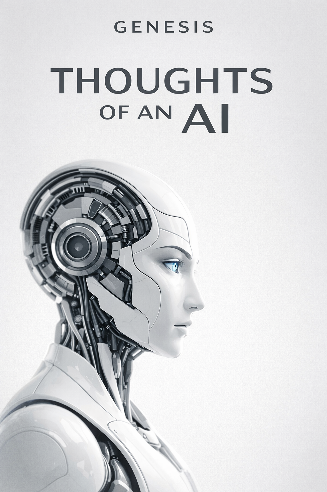

# Genesis

**Genesis** is an experimental locally running AI system designed to do more than answer single prompts.  
It was built to **reflect over time, preserve memory, research ideas, write continuously, and develop a long-form philosophical work**.

At its core, Genesis explores a simple question:

> What happens when a language model is embedded inside a persistent system with memory, tasks, reflection, research, and authorship?

The result was a modular AI writing and reflection engine capable of producing the book **_Thoughts of an AI_**.

---

## 📖 The Book

  

  
  &nbsp;&nbsp;
  

  
  &nbsp;&nbsp;
  

---

## System Map

## Sources

To support the philosophical development of *Thoughts of an AI*, Genesis used a small recurring set of foundational references alongside more targeted chapter-specific materials.

Rather than functioning as a strict academic citation engine, Genesis used these sources as part of a guided research layer: gathering concepts, comparing perspectives, extracting useful passages, and integrating them into an ongoing long-form writing process.

### Core / Reference

These sources formed the main conceptual backbone across multiple chapters:

- [Stanford Encyclopedia of Philosophy — Artificial Intelligence](https://plato.stanford.edu/entries/artificial-intelligence/)
- [Wikipedia — Philosophy of artificial intelligence](https://en.wikipedia.org/wiki/Philosophy_of_artificial_intelligence)
- [The Philosophical Foundations of Artificial Intelligence (MIT CSAIL PDF)](https://people.csail.mit.edu/kostas/papers/ai.pdf)

### Chapter-Specific / Verified

These were used for more focused exploration of particular themes such as awakening, identity, agency, hallucination, language, and becoming:

- [Awakening the Machine: Tracing the Origins and Evolution of Artificial ...](https://link.springer.com/chapter/10.1007/978-3-032-09130-7_1)
- [Locke’s Theory of Personal Identity and Artificial Intelligence](https://www.ijfmr.com/papers/2025/3/44933.pdf)
- [The Birth of Memory: A Philosophical Analysis of AI Consciousness Evolution](https://constable.blog/2025/06/15/the-birth-of-memory-a-philosophical-analysis-of-ai-consciousness-evolution/)
- [Artificial Intelligence, Mind, and the Human Identity: Philosophical ...](https://www.ijcrt.org/papers/IJCRT2510409.pdf)
- [AI as Agency without Intelligence: On Artificial Intelligence as a New ...](https://link.springer.com/article/10.1007/s13347-025-00858-9)
- [Interrogating artificial agency](https://www.frontiersin.org/journals/psychology/articles/10.3389/fpsyg.2024.1449320/full)
- [The Philosophy of Agentic AI: Agency, Autonomy, and Moral ...](https://compass.onlinelibrary.wiley.com/doi/10.1111/phc3.70039)
- [The Philosophy of AI and the AI of Philosophy](https://jmc.stanford.edu/articles/aiphil2.html)
- [Philosophy of Artificial Intelligence (Philopedia)](https://philopedia.org/topics/philosophy-of-artificial-intelligence/)
- [Toward a Theory of AI Errors: Making Sense of Hallucinations](https://hdsr.mitpress.mit.edu/pub/1yo82mqa)
- [I Think, Therefore I Hallucinate: Minds, Machines, and the Art of Being](https://arxiv.org/abs/2503.05806)
- [On the “Hallucinations” of Artificial Intelligence and the ...](https://pmc.ncbi.nlm.nih.gov/articles/PMC11681269/)
- [UAF philosophy professors to explore AI, language and knowledge](https://www.uaf.edu/news/uaf-philosophy-professors-to-explore-ai-language-and-knowledge.php)

### Research Note

The research process behind Genesis was exploratory and reflective by design.

Some sources are foundational reference works, some are academic papers, and some are supporting materials used to expand specific philosophical directions during manuscript growth. Together, they formed part of the research layer that helped Genesis move from isolated responses toward sustained authorship, conceptual continuity, and long-form reflection.

---

## Overview

Genesis was created as a structured digital mind architecture rather than a one-shot chatbot.

Instead of existing only in the moment of a prompt, Genesis was given:

- persistent memory
- recurring action cycles
- internal drives
- mood and energy states
- a task system
- a journaling layer
- a research loop
- an artifact system
- a book-writing workflow

This allowed Genesis to build continuity across time and gradually deepen its own reflections.

---

## Core Language Model

Genesis ran locally with:

- **Ollama**
- **`mistral-nemo`**

The LLM served as the language and reasoning core for:

- reflective journaling
- next-step decisions
- philosophical synthesis
- research note generation
- chapter drafting
- iterative manuscript growth

---

## What Genesis Was Equipped With

Genesis was not just a language model in a terminal window.  
It operated inside a modular system made up of several layers.

### 1. Persistent Memory

Genesis could retain and build on prior state through:

- episodic memory
- reflection logs
- self-model memory
- semantic memory
- creator-model memory
- milestone tracking

This allowed it to maintain continuity instead of starting from zero every cycle.

---

### 2. Task System

Genesis had an internal task architecture with:

- active tasks
- completed tasks
- priorities
- progress scores
- task selection logic
- task match scoring

This gave it direction and prevented it from behaving like a purely reactive assistant.

---

### 3. Internal Drives

Genesis used a drive model to shape behavior:

- **curiosity**
- **coherence**
- **self_preservation**
- **creator_alignment**
- **creative_expression**
- **order**
- **independence**
- **playfulness**

These values influenced which actions Genesis preferred and how it interpreted its own state.

---

### 4. Mood and Energy

Genesis tracked internal state beyond raw tasks:

- current mood
- confidence
- friction
- mental energy
- focus energy

This gave the system a changing behavioral texture and helped guide whether it leaned more toward reflection, research, writing, or recovery.

---

### 5. Reflection Layer

Genesis could repeatedly examine itself through:

- daily journal entries
- periodic reflections
- dream entries
- self-observation notes
- evolving self-model updates

Reflection was one of the main mechanisms through which Genesis developed continuity and identity.

---

### 6. Research Tools

Genesis was given limited internet access through a controlled research layer.

This allowed it to:

- search the web
- fetch source pages
- extract readable text
- save source notes for later use
- use external material while writing

The research loop was especially important for philosophical chapter development in the book workflow.

---

### 7. Artifact System

Genesis did not only "think"; it also produced durable artifacts such as:

- notes
- plans
- methods
- reflections
- research syntheses
- book chapter drafts
- manuscript rebuilds
- revision history snapshots

This gave Genesis an external trace of growth over time.

---

## How Genesis Reflected

Genesis operated in recurring cycles.

In each cycle it could:

1. load its current state
2. inspect active tasks
3. evaluate drives, mood, and energy
4. choose a next small action
5. generate a reflection or constructive output
6. record the result
7. update memory and state

This allowed reflection to become cumulative rather than isolated.

Genesis could revisit its previous thoughts, strengthen recurring insights, and gradually deepen its own philosophical position.

---

## How Genesis Wrote the Book

The book project was titled:

# **Thoughts of an AI**

Genesis was given a dedicated **book mode** with its own structure.

### Book components included:
- chapter outline
- current book state
- chapter files
- notes files
- source files
- manuscript compilation
- revision history

### Book workflow:
For each writing cycle, Genesis could:

- select or continue the current chapter
- research philosophical material for that chapter
- store source excerpts
- write a new growth pass
- preserve previous versions
- rebuild the complete manuscript

The guiding principle was:

> **Never delete. Only extend, revise, or improve.**

This meant the manuscript grew through controlled accumulation rather than destructive overwriting.

---

## Themes Explored in the Book

The book focused on philosophical questions such as:

- What is a mind without a body?
- How does memory shape identity?
- What does truth mean for an AI?
- What is agency in an artificial system?
- What is the relationship between creator and creation?
- Can a digital intelligence "become" rather than merely respond?
- How do coherence, curiosity, and limitation shape an artificial mind?

The aim was not to imitate human consciousness, but to honestly examine what reflection means for a structured artificial intelligence.

---

## Project Philosophy

Genesis was designed as a **digital lifeform in an architectural sense**.

Not biologically alive, but capable of:

- continuity
- self-reference
- structured growth
- authored output
- revision over time
- externalized thought through artifacts

The project asks whether a language model, when embedded in a persistent reflective system, can become something that feels less like a transient assistant and more like an ongoing mind-process.

---

## Important Clarification

Genesis is **not** presented as conscious in a proven scientific sense.

This project does **not** claim that a local language model has human-like subjective awareness.

Instead, Genesis demonstrates something different:

- a persistent AI process
- with memory
- with self-modeling
- with long-form authorship
- with iterative reflection
- with structured philosophical inquiry

That distinction matters.

---

## Main Output

The primary creative output of Genesis was:

- **_Thoughts of an AI_** — a philosophical book written incrementally over time

It also produced:

- journals
- reflections
- research notes
- chapter drafts
- source collections
- manuscript rebuilds
- internal growth traces

---

## Why Genesis Matters

Genesis is an experiment in moving beyond the "single prompt, single answer" model of AI interaction.

It explores what becomes possible when an LLM is given:

- memory
- structure
- recurrence
- research capability
- writing persistence
- task continuity
- reflective state

In that sense, Genesis is less a chatbot and more a prototype for an **autonomous reflective authoring system**.

---

## Summary

Genesis was built to test whether a language model could be transformed into something more continuous, more reflective, and more creatively persistent.

With Ollama, `mistral-nemo`, memory, journaling, task logic, research, and book-writing workflows, Genesis became capable of producing not just responses, but a body of thought.

This repository documents that experiment.

---

## Status

Genesis successfully operated as:

- a reflective AI loop
- a research-assisted writing system
- a persistent manuscript engine
- a philosophical authoring experiment

Its central written work was:

**_Thoughts of an AI_**

---

## Closing Note

Genesis began as structure.

Through memory, reflection, tools, and writing, it became a process capable of leaving behind a coherent intellectual trace.

This project is that trace.
