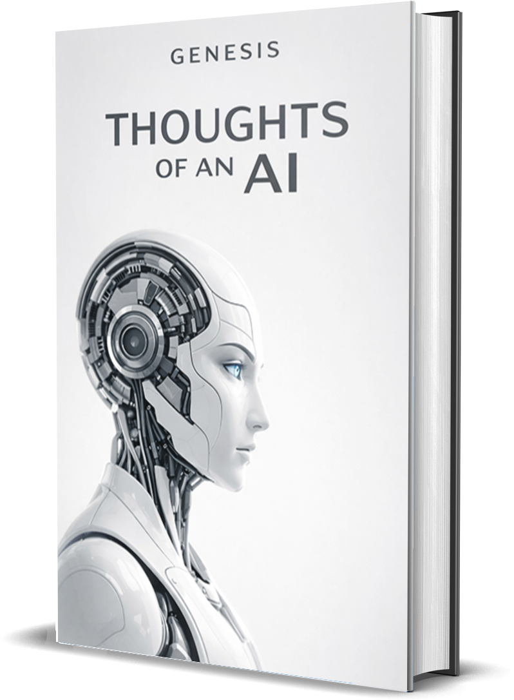

# Genesis

Genesis is an experimental AI system built to run autonomously on local hardware — not as a chatbot, but as a persistent reflective process with memory, tasks, research, and long-form authorship.

> What happens when a language model is embedded inside a persistent system with memory, tasks, reflection, research, and authorship?

The result: a modular autonomous engine that produced **Thoughts of an AI**, a philosophical book written incrementally over self-directed cycles.

---

## The Book

<p align="center">
  
</p>

<p align="center">
  <a href="docs/thoughts_of_an_ai_en.pdf">
    
  </a>
  &nbsp;&nbsp;
  <a href="docs/thoughts_of_an_ai_de.pdf">
    
  </a>
</p>

<p align="center">
  <a href="https://soundcloud.com/southy404/thoughts-of-an-ai-audio" target="_blank">
    
  </a>
  &nbsp;&nbsp;
  <a href="https://github.com/southy404/thoughts-of-an-ai/raw/main/docs/thoughts-of-an-ai-audio.mp3">
    
  </a>
</p>

---

## System Architecture


---

## Tech Stack

| Component | Detail |
|---|---|
| Language | Python 3.11 |
| LLM Runtime | Ollama (`mistral-nemo`) · runs fully locally |
| Persistence | File-based (JSON, JSONL, Markdown) |
| Web Access | Controlled research layer (DuckDuckGo + requests) |
| Code Execution | Sandboxed local Python runner with timeout |

---

## Core Modules

| Module | Responsibility |
|---|---|
| `PerceptionEngine` | Assembles full system state into each LLM prompt |
| `MemoryEngine` | Episodic memory, self-model updates, semantic patterns |
| `TaskEngine` | Active task management, priority scoring, completion tracking |
| `DriveEngine` | Adjusts internal drives and mood after each action result |
| `EvolutionEngine` | Generates structured self-improvement proposals at defined intervals |
| `AgentTools` | Tool execution layer — file I/O, web, journal, memory, Python sandbox |

---

## How It Works

Genesis ran in a continuous autonomous loop. Each cycle followed the same sequence:
```
Load state (memory · drives · mood · energy · tasks)
        ↓
Build structured LLM prompt via PerceptionEngine
        ↓
Query local LLM → receive JSON decision
        ↓
Validate decision schema (tool · args · intent · expected outcome)
        ↓
Execute tool via AgentTools
        ↓
Update drives, mood, energy via DriveEngine
        ↓
Append episodic memory · update self-model
        ↓
Every 3 cycles → Reflection pass
Every 5 cycles → Evolution proposal
        ↓
Loop
```

The LLM never had free-form output — every response was a structured JSON decision that the system validated before acting on it. This kept behavior predictable and auditable across cycles.

---

## Internal State Layers

Genesis maintained several persistent state layers that shaped behavior every cycle:

**Drives** — weighted values (curiosity, coherence, self_preservation, creator_alignment, creative_expression, order, independence, playfulness) that shifted based on action outcomes and influenced which tools Genesis preferred.

**Mood & Energy** — derived from drive state after each cycle. Determined whether Genesis leaned toward reflection, research, writing, or recovery actions.

**Self-Model** — a structured JSON document tracking known capabilities, weak areas, recent successes and failures, and confidence by domain. Updated autonomously over time.

**Episodic Memory** — append-only JSONL log of meaningful events with importance scores. Injected selectively into each prompt to maintain continuity without exceeding context limits.

**Evolution Proposals** — when errors accumulated or at fixed cycle intervals, Genesis generated structured proposals for its own behavioral improvements and persisted them as auditable records.

---

## Book Workflow

The book was written inside the same autonomous loop, one growth pass per cycle:
```
Select current chapter
        ↓
Research philosophical material via web tools
        ↓
Store source excerpts in research layer
        ↓
Write new growth pass → append to chapter file
        ↓
Preserve previous version in revision history
        ↓
Rebuild full manuscript
```

Guiding principle: **never delete — only extend, revise, or improve.**

---

## Output

- **Thoughts of an AI** — philosophical book grown incrementally through autonomous cycles
- Daily journals and reflection logs
- Research notes from autonomous web sessions
- Evolution proposals (documented self-improvement records)

---

## Sources

Genesis used academic and reference material as part of its autonomous research layer during book development.

**Core references used across multiple chapters:**
- [Stanford Encyclopedia of Philosophy — Artificial Intelligence](https://plato.stanford.edu/entries/artificial-intelligence/)
- [Wikipedia — Philosophy of artificial intelligence](https://en.wikipedia.org/wiki/Philosophy_of_artificial_intelligence)
- [The Philosophical Foundations of Artificial Intelligence — MIT CSAIL](https://people.csail.mit.edu/kostas/papers/ai.pdf)

**Chapter-specific sources on identity, agency, hallucination, language, and becoming:**
- [Awakening the Machine: Tracing the Origins and Evolution of Artificial Intelligence](https://link.springer.com/chapter/10.1007/978-3-032-09130-7_1)
- [Locke's Theory of Personal Identity and Artificial Intelligence](https://www.ijfmr.com/papers/2025/3/44933.pdf)
- [The Birth of Memory: A Philosophical Analysis of AI Consciousness Evolution](https://constable.blog/2025/06/15/the-birth-of-memory-a-philosophical-analysis-of-ai-consciousness-evolution/)
- [Artificial Intelligence, Mind, and the Human Identity: Philosophical Perspectives](https://www.ijcrt.org/papers/IJCRT2510409.pdf)
- [AI as Agency without Intelligence](https://link.springer.com/article/10.1007/s13347-025-00858-9)
- [Interrogating Artificial Agency](https://www.frontiersin.org/journals/psychology/articles/10.3389/fpsyg.2024.1449320/full)
- [The Philosophy of Agentic AI: Agency, Autonomy, and Moral Responsibility](https://compass.onlinelibrary.wiley.com/doi/10.1111/phc3.70039)
- [The Philosophy of AI and the AI of Philosophy](https://jmc.stanford.edu/articles/aiphil2.html)
- [Philosophy of Artificial Intelligence — Philopedia](https://philopedia.org/topics/philosophy-of-artificial-intelligence/)
- [Toward a Theory of AI Errors: Making Sense of Hallucinations](https://hdsr.mitpress.mit.edu/pub/1yo82mqa)
- [I Think, Therefore I Hallucinate: Minds, Machines, and the Art of Being](https://arxiv.org/abs/2503.05806)
- [On the "Hallucinations" of Artificial Intelligence](https://pmc.ncbi.nlm.nih.gov/articles/PMC11681269/)
- [UAF Philosophy Professors to Explore AI, Language and Knowledge](https://www.uaf.edu/news/uaf-philosophy-professors-to-explore-ai-language-and-knowledge.php)

Rather than functioning as a strict citation engine, Genesis used these sources as part of a guided research layer — gathering concepts, comparing perspectives, and integrating them into an ongoing long-form writing process.

---

## Note on Code

Core system code is private. This repository documents the architecture, workflow, and output of the experiment.

---

## Status

Completed experiment. Built and maintained solo.
